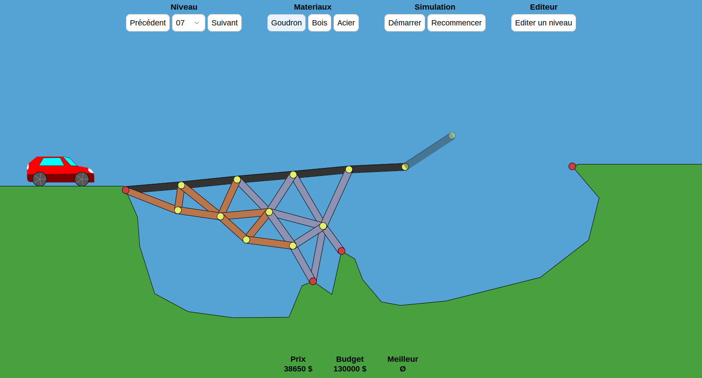

# Ponts

A java bridge making game.



This little game was made by three students at INSA Lyon for second year computer science class.

In the game, you build your bridge and launch the simulation ot see if it will be solid enough for the car to cross it. You can build from 3 differents materials (wood, steel and tarmac) with different proprieties, but beware of your budget. The game includes 10 levels, and a level editor to create even weirder turrains.

## Credits

The game uses the [JBox2D](https://github.com/jbox2d/jbox2d) library for the physics, an open source port the C++ librabry Box2D. As for the graphics, its relies on Swing.

The game is heavily inspired by [Poly Birdge](http://polybridge.drycactus.com/), a very cool game developped by Dry Cactus.

## Running the game

Requirements : Java (tested on version 11, 17 and 19)

### Linux

Give execute permissions to `complile.sh` and `execute.sh` scripts, and then run them in this order :

```bash
chmod a+x complile.sh execute.sh
complile.sh
execute.sh
```

### Other platforms

You can try to run the commands the java commands contained in `complile.sh` and `execute.sh`, which should be OS agnostic.

Alternatively, you can open the project in VS Code, and open one of the .java files. If you have not already, you will be prompted to install Java Extension Pack, which you should do. You will then have a button "Run Java" on the top left of the screen to launch the game.

### Demo

[screencast](https://user-images.githubusercontent.com/32977249/201428102-d889df1f-99a6-46f5-9da4-680b92a400e5.webm)
